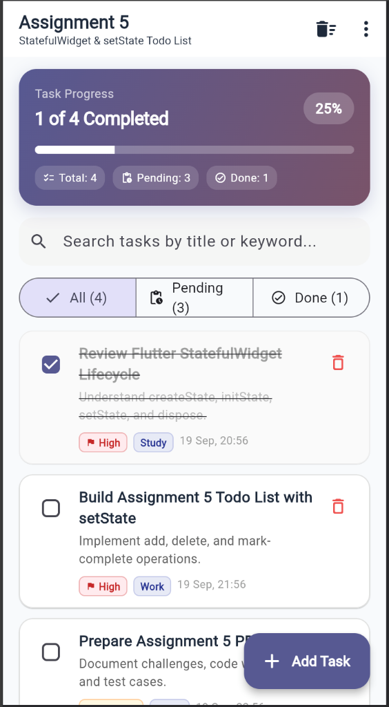
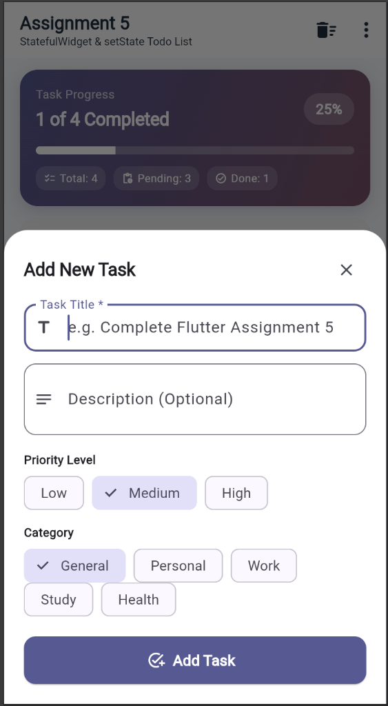
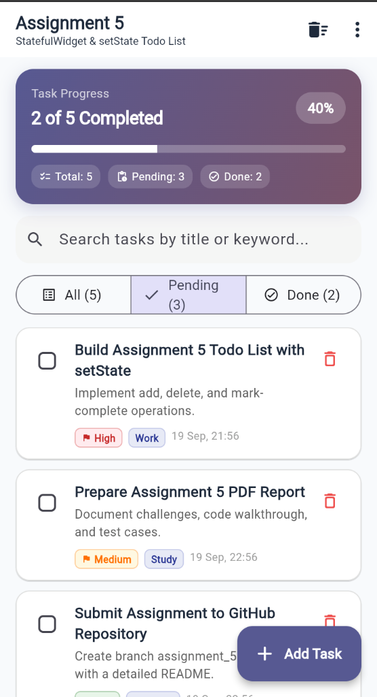
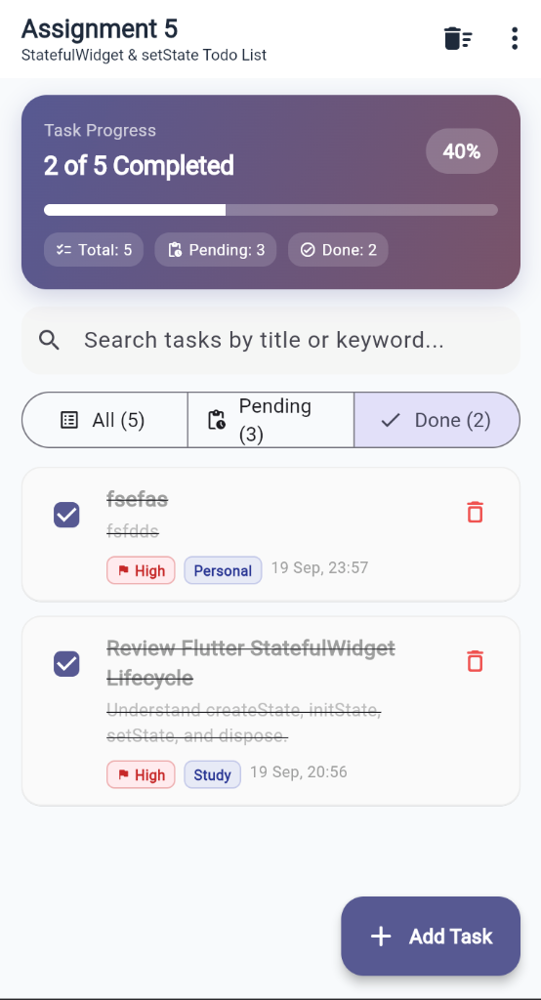

# Assignment 5 Report - Interactive Todo List with StatefulWidget & setState

**Student Name:** Pranav Kale  
**Roll No:** 150096724142  
**Course / Subject:** Flutter Application Development  
**Date:** September 2026  

---

## 1. What the Assignment Was

Build a fully functional **Todo List** application in Flutter using **`StatefulWidget`** and **`setState()`** to manage local UI state. The application must support:
1. **Adding tasks** with an intuitive modal form interface.
2. **Deleting tasks** with swipe-to-dismiss and icon buttons, backed by undo restoration.
3. **Marking tasks complete** (and unmarking) with immediate visual feedback (strike-through text, updated checkboxes, and recalculation of progress metrics).
4. Categorization, priority tagging, progress visualization, and status filtering.

---

## 2. Files & Project Structure

```
assignment_5/
├── lib/
│   ├── main.dart                      # Application entry point, Material 3 theming & initial route
│   ├── models/
│   │   ├── todo_item.dart             # Immutable task model with copyWith, priorities, & categories
│   │   └── todo_filter.dart           # Filter state enum (all, active, completed)
│   ├── screens/
│   │   └── todo_list_screen.dart      # Primary StatefulWidget hosting task list & setState operations
│   └── widgets/
│       ├── todo_tile.dart             # Dismissible card with checkbox, strike-through, & delete action
│       ├── todo_stats_card.dart       # Gradient card showing progress bar & task counts
│       ├── add_todo_sheet.dart        # Modal bottom sheet form for task creation
│       ├── filter_bar.dart            # Segmented button widget for status filtering
│       └── empty_todo_view.dart       # Illustrated empty state view
├── test/
│   ├── todo_model_test.dart           # 4 unit tests for TodoItem model & copyWith logic
│   └── widget_test.dart               # 5 widget tests for add, toggle-complete, delete, and filter
├── docs/
│   ├── report.md                      # Comprehensive academic report
│   └── assignment5_report.html        # Styled printable report
├── pubspec.yaml                       # Dependencies configuration
└── README.md                          # Full project documentation & architecture overview
```

---

## 3. Concepts Used

### A. StatefulWidget & setState() Mechanics
In Flutter, widgets that require mutable state must subclass `StatefulWidget` paired with a separate `State` class. Whenever the internal state changes:
- `setState(() { ... })` notifies the Flutter framework that the internal state has mutated.
- The framework schedules a call to the `build()` method for this State object, triggering a fast, declarative diffing of the widget sub-tree.

```dart
// Adding a task
void _addTodo(TodoItem item) {
  setState(() {
    _todos.insert(0, item);
  });
}

// Toggling completion
void _toggleTodoComplete(String id, bool? isCompleted) {
  final index = _todos.indexWhere((t) => t.id == id);
  if (index != -1) {
    setState(() {
      _todos[index] = _todos[index].copyWith(
        isCompleted: isCompleted ?? !_todos[index].isCompleted,
      );
    });
  }
}

// Deleting a task
void _deleteTodo(String id) {
  final index = _todos.indexWhere((t) => t.id == id);
  if (index != -1) {
    setState(() {
      _todos.removeAt(index);
    });
  }
}
```

### B. Immutable Data Modeling with `copyWith`
To avoid unpredictable side-effects, the `TodoItem` model is immutable (`final` fields). When a property changes (such as toggling `isCompleted`), a new instance is produced via `copyWith()`. This guarantees predictable state flow and prevents accidental in-place mutations.

### C. Touch-Friendly Swipe to Delete (`Dismissible`)
`Dismissible` wraps each task tile:
- Requires a unique `Key` (`ValueKey(todo.id)`).
- Sets `direction: DismissDirection.endToStart` to reveal a red background with a delete icon.
- `onDismissed` triggers `_deleteTodo()`, removing the item from the backing array.

### D. Undo Mechanism via `ScaffoldMessenger` & `SnackBarAction`
When a task is deleted, a floating `SnackBar` displays an **UNDO** action. If tapped, the saved item is re-inserted at its original index within a `setState()` block, restoring the UI seamlessly.

---

## 4. Implementation Details

### 1. Task Progress Tracking (`TodoStatsCard`)
Calculates completion progress dynamically:
```dart
final double progress = totalCount == 0 ? 0.0 : (completedCount / totalCount);
```
Renders a linear progress bar and metric badges showing Total, Pending, and Done tasks.

### 2. Task Filtering & Search
- **Status Filter:** Segmented buttons for `All`, `Pending`, and `Done` dynamically filter `_todos` on the fly.
- **Search Query:** A search `TextField` filters tasks by matching keywords against both `title` and `description`.

### 3. Modal Bottom Sheet (`AddTodoSheet`)
Provides a slide-up dialog with:
- Title `TextFormField` with required validation (`val.trim().length >= 2`).
- Optional description field.
- Choice chips for Priority (`Low`, `Medium`, `High`).
- Choice chips for Category (`General`, `Personal`, `Work`, `Study`, `Health`).

---

## 5. Visual Verification & Output Screenshots

The application was run and validated in Google Chrome (`flutter run -d chrome`). The following screenshots document its operation across task addition, progress calculation, completion toggling, and tab filtering:

### A. All Tasks View (Completion Strikethrough & Progress)

*Figure 1: Main screen displaying 4 tasks with 1 completed (25% progress). Completed tasks feature strikethrough titles and checkboxes.*

### B. Add New Task Modal Bottom Sheet

*Figure 2: Slide-up modal sheet with required task title validation, description, priority choice chips (Low, Medium, High), and category tags.*

### C. Pending Tasks Tab Filtering

*Figure 3: Filtering by Pending (3) tasks. Total tasks updated to 5 with 2 completed (40% progress).*

### D. Completed / Done Tasks Tab Filtering

*Figure 4: Filtering by Done (2) tasks. Only completed tasks are displayed, preserving the 40% overall completion progress.*

---

## 6. Verification & Testing

The application includes an automated test suite comprising **9 test cases** that pass with 100% success:

```
$ flutter test
00:00 +0: TodoItem Model Tests initializes with expected default values
00:00 +1: TodoItem Model Tests copyWith updates fields while preserving unedited values
00:00 +2: TodoItem Model Tests formattedDate produces formatted day, month, and time
00:00 +3: TodoItem Model Tests equality and hashCode verify value semantics
00:00 +4: Screen renders initial tasks and progress summary correctly
00:00 +5: Toggling task completion updates checkbox and completion stats
00:01 +6: Adding a new task via AddTodoSheet inserts it into state and list
00:01 +7: Deleting a task removes it from state with working undo action
00:01 +8: Filter tabs switch between All, Pending, and Completed tasks
00:01 +9: All tests passed!
```

### Static Analysis
`flutter analyze` confirms **Zero warnings and zero errors**:
```
$ flutter analyze
Analyzing assignment_5...
No issues found! (ran in 2.5s)
```

---

## 7. Challenges & Solutions

| Challenge | Solution |
| :--- | :--- |
| **Accidental State Mutation** | In Dart, mutating a list item in-place without replacing it can lead to subtle bugs where widgets don't properly re-render. Resolved by making `TodoItem` completely immutable and updating state using `copyWith`. |
| **Dismissible Key Duplication** | When deleting items in a `ListView.builder`, if duplicate keys or raw index keys are used, Flutter can throw "A Dismissible widget is still part of the tree". Resolved by using unique timestamp IDs (`ValueKey(todo.id)`). |
| **Keyboard Overlap in Modal Sheet** | In bottom sheets, when the software keyboard opens, it can obscure the submit button. Resolved by calculating `MediaQuery.of(context).viewInsets.bottom` and applying it as bottom padding. |
| **Restoring Item Order on Undo** | If an undone item is simply appended with `.add()`, it jumps to the bottom of the list. Resolved by saving the original index of the removed task and using `_todos.insert(index, removed)` during the undo action. |

---

## 7. How to Run

1. Open a terminal in the assignment directory:
   ```bash
   cd /Users/pranavkale/Desktop/assignment_flutter/assignment_5
   ```
2. Run automated tests:
   ```bash
   flutter test
   ```
3. Run the app on Google Chrome or macOS:
   ```bash
   flutter run -d chrome
   ```
