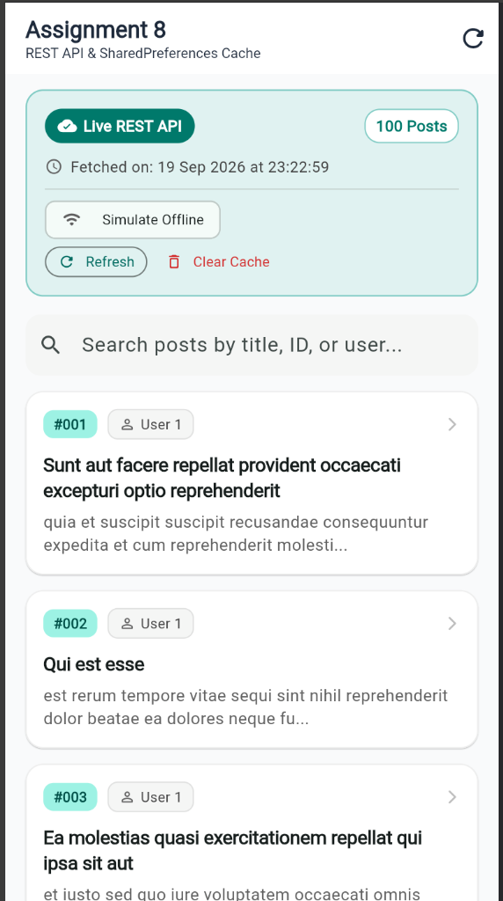
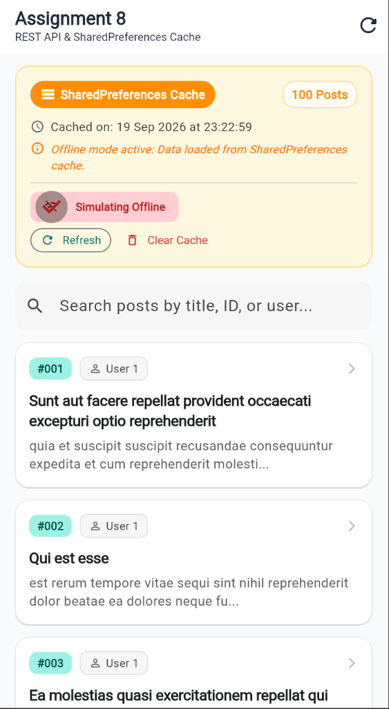
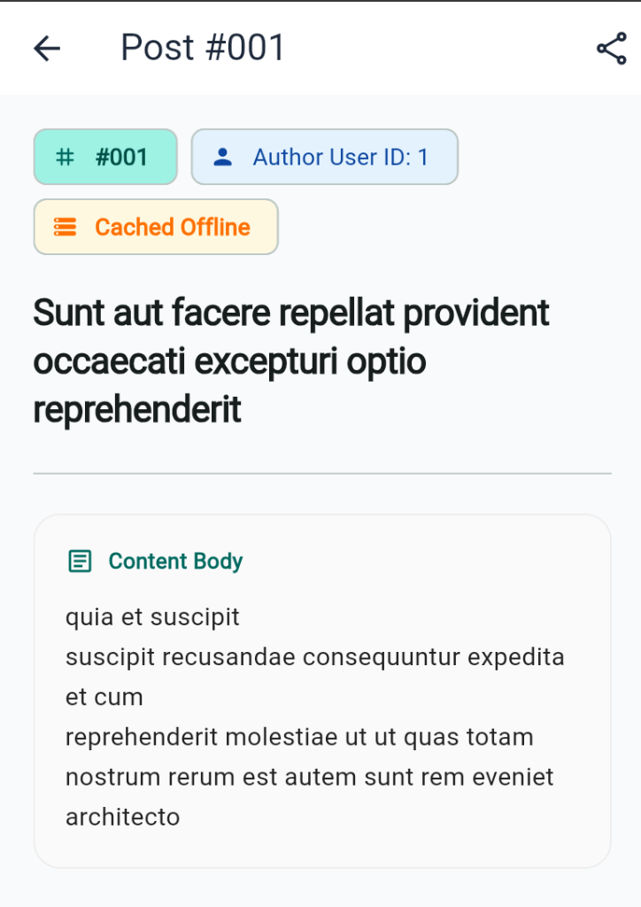

# 📘 Assignment 8: Comprehensive Code Explanation, Challenges Faced & Visual Walkthrough

**Student Name:** Pranav Kale  
**Roll No:** 150096724142  
**Course:** Flutter Application Development (BTech CSE 2024-28)  
**Assignment Topic:** Fetch data from a public REST API (JSONPlaceholder), display it with `FutureBuilder`, and cache the last result using `SharedPreferences`.

---

## 📸 1. App Execution & Verification Screenshots

The following screenshots demonstrate the running application across its three primary functional states:

### Screenshot 1: Live REST API Mode (Initial Fetch)


**Key Observations in Screenshot 1:**
- **Status Indicator:** Displays the teal **"Live REST API"** pill and **"100 Posts"** count badge.
- **Timestamp Tracking:** Shows the exact network fetch time: `Fetched on: 19 Sep 2026 at 23:22:59`.
- **Dynamic Post List:** Posts retrieved directly from `https://jsonplaceholder.typicode.com/posts` are rendered with custom formatted ID tags (`#001`, `#002`, `#003`), author badges (`User 1`), bold capitalized titles, and text snippets.
- **Offline Toggle:** The "Simulate Offline" chip is inactive, indicating normal online operation.
- **Cache Synchronization:** Behind the scenes, the 100 posts and the timestamp were automatically serialized and written to `SharedPreferences`.

---

### Screenshot 2: Offline / Cached Fallback Mode (SharedPreferences Persistence)


**Key Observations in Screenshot 2:**
- **Cache Indicator:** The header dynamically transitions to an amber **"SharedPreferences Cache"** badge.
- **Timestamp Preservation:** Displays `Cached on: 19 Sep 2026 at 23:22:59`, proving that the data was retrieved from local disk storage rather than the network.
- **Notice Banner:** An italicized notice alerts the user: *"Offline mode active: Data loaded from SharedPreferences cache."*
- **Offline Simulation Active:** The "Simulating Offline" chip is highlighted in red/pink with the `wifi_off` icon, demonstrating the cache fallback without needing to disable system Wi-Fi.
- **Data Integrity:** All 100 posts remain accessible, scrollable, and searchable offline.

---

### Screenshot 3: Post Detail Inspection Screen


**Key Observations in Screenshot 3:**
- **Navigation Flow:** Tapping post `#001` navigates to `PostDetailScreen`.
- **Metadata Tags:** Displays `#001` ID tag, `Author User ID: 1`, and the `Cached Offline` status chip.
- **Full Content Body:** Renders the complete, unclipped post text inside a card container.
- **Attribution:** Displays the source attribution card linking back to JSONPlaceholder (`https://jsonplaceholder.typicode.com/posts/1`).
- **Interactive Back Button & Actions:** Allows seamless return navigation to the post list while preserving the list scroll position.

---

## 💻 2. In-Depth Code Explanation

The project follows a clean, modular architecture separating models, data sources, business logic, and presentation:

```
assignment_8/
├── lib/
│   ├── models/
│   │   ├── post.dart                  # Data entity & JSON serialization
│   │   └── post_result.dart           # Bundles posts with cache metadata
│   ├── services/
│   │   ├── api_service.dart           # Network HTTP client
│   │   ├── cache_service.dart         # SharedPreferences storage manager
│   │   └── post_repository.dart       # Orchestrator & offline fallback logic
│   ├── screens/
│   │   ├── post_list_screen.dart      # FutureBuilder UI & search filter
│   │   └── post_detail_screen.dart    # Full post detail view
│   └── widgets/
│       ├── cache_status_banner.dart   # Interactive status header
│       ├── post_card.dart             # Card widget for individual post
│       ├── loading_skeleton.dart      # Shimmer loading skeleton
│       └── error_display.dart         # Error state & retry CTA
```

---

### A. Data Layer (`lib/models/`)

#### 1. `post.dart`
Defines the `Post` data model. Key methods:
- **`fromJson(Map<String, dynamic> json)`**: Implements Dart 3 pattern matching to safely map JSON attributes:
  ```dart
  factory Post.fromJson(Map<String, dynamic> json) {
    return switch (json) {
      {
        'id': final int id,
        'userId': final int userId,
        'title': final String title,
        'body': final String body,
      } => Post(id: id, userId: userId, title: title, body: body),
      _ => Post(
          id: (json['id'] as num?)?.toInt() ?? 0,
          userId: (json['userId'] as num?)?.toInt() ?? 0,
          title: json['title'] as String? ?? '',
          body: json['body'] as String? ?? '',
        ),
    };
  }
  ```
- **`toJson()`**: Maps class properties back to `Map<String, dynamic>` so they can be serialized by `jsonEncode()` for caching.
- **Display Getters**:
  - `capitalizedTitle`: Capitalizes the first letter for professional typography.
  - `formattedId`: Generates `#001`, `#042` with leading zero padding.
  - `snippet`: Truncates body text to 90 characters with trailing ellipsis.

#### 2. `post_result.dart`
A wrapper object returned by the repository:
```dart
class PostResult {
  final List<Post> posts;
  final bool isFromCache;
  final DateTime timestamp;
  final String? notice;
  ...
}
```
This decouples the UI from low-level storage keys, allowing the UI to simply read `isFromCache` and `formattedTime`.

---

### B. Service Layer (`lib/services/`)

#### 1. `api_service.dart`
Handles network communication using `package:http`:
- **Endpoint:** `https://jsonplaceholder.typicode.com/posts`
- **Client Injection:** Takes an optional `http.Client` parameter for clean unit testing with `MockClient`.
- **Status Validation:**
  ```dart
  final response = await _client.get(uri).timeout(timeout);
  if (response.statusCode == 200) {
    final decoded = jsonDecode(response.body) as List;
    return decoded.map((item) => Post.fromJson(item)).toList();
  } else {
    throw ApiException('Server error HTTP ${response.statusCode}');
  }
  ```
- **Cross-Platform Exception (`ApiException`):** Uses custom Dart exceptions rather than `dart:io` classes, making the networking code compatible with Web, Android, iOS, macOS, Windows, and Linux.

#### 2. `cache_service.dart`
Encapsulates all `SharedPreferences` operations:
- **`savePosts(List<Post> posts, [DateTime? timestamp])`**:
  Converts the `List<Post>` to JSON:
  ```dart
  final jsonString = jsonEncode(posts.map((p) => p.toJson()).toList());
  await prefs.setString(keyCachedPosts, jsonString);
  await prefs.setString(keyCachedTime, (timestamp ?? DateTime.now()).toIso8601String());
  ```
- **`getCachedPosts()`**:
  Reads the raw JSON string from storage, checks for null or corruption, and deserializes back into `List<Post>`.
- **`clearCache()`**:
  Removes keys `cached_posts_data` and `cached_posts_time`, enabling verification of the empty-cache state.

#### 3. `post_repository.dart`
Coordinates the **Network-First with Cache-Fallback** workflow:
1. **Check Offline Simulation:** If `simulateOffline == true`, immediately attempts to load from `CacheService`.
2. **Execute Live Network Request:** Queries `ApiService.fetchPosts()`.
   - **On Success:** Saves the fresh payload to `CacheService` along with the current timestamp and returns `PostResult(posts, isFromCache: false)`.
   - **On Failure:** Catches the network error, checks `CacheService.getCachedPosts()`. If cached data exists, it returns `PostResult(cached, isFromCache: true, notice: 'Network unavailable. Serving cached data.')`.
   - **On Total Failure (No Internet & No Cache):** Throws a user-friendly `ApiException` prompting the user to retry.

---

### C. Presentation Layer (`lib/screens/` & `lib/widgets/`)

#### 1. `post_list_screen.dart`
The core screen integrating `FutureBuilder`:
- **Safe Future Initialization:**
  ```dart
  @override
  void initState() {
    super.initState();
    // Instantiated ONCE in initState to prevent infinite fetch loops
    _futurePosts = widget.repository.fetchPosts();
  }
  ```
- **Declarative State Rendering:**
  ```dart
  FutureBuilder<PostResult>(
    future: _futurePosts,
    builder: (context, snapshot) {
      if (snapshot.connectionState == ConnectionState.waiting) {
        return const LoadingSkeleton();
      }
      if (snapshot.hasError) {
        return ErrorDisplay(error: snapshot.error!, onRetry: _refresh);
      }
      if (snapshot.hasData) {
        return CustomScrollView(/* Banner, Search Field, SliverList */);
      }
      return const SizedBox.shrink();
    },
  );
  ```
- **Client-Side Search:**
  Filters `result.posts` locally by title, post ID, or user ID using `TextField(onChanged: ...)`. This provides instantaneous search results without incurring repeated network calls or cache reads.
- **Refresh & Clear Cache Controls:**
  - `_refresh()` updates `_futurePosts = widget.repository.fetchPosts(forceRefresh: true)` and calls `setState()`.
  - `_confirmClearCache()` displays an `AlertDialog` before invalidating `SharedPreferences`.

#### 2. Reusable UI Components
- **`CacheStatusBanner`**: Renders dynamic badges (Teal "Live REST API" vs Amber "SharedPreferences Cache"), timestamp, total count, and action controls.
- **`PostCard`**: Material 3 elevated card featuring an ID pill, author tag, title, and body preview.
- **`LoadingSkeleton`**: Multi-card shimmering placeholder layout shown during `ConnectionState.waiting`.
- **`ErrorDisplay`**: Centered error illustration, message, and "Try Again" CTA shown when `snapshot.hasError`.
- **`PostDetailScreen`**: Detailed view displaying the complete post body and API attribution.

---

## ⚡ 3. Challenges Faced & Solutions

### Challenge 1: The `FutureBuilder` Infinite Fetch Rebuild Loop
* **The Problem:** In Flutter, the `build()` method is invoked frequently (e.g., when the user types in the search bar, when animations trigger, or when screen orientation changes). If `repository.fetchPosts()` is called directly inside `FutureBuilder(future: repository.fetchPosts())`, every single keystroke in the search bar triggers a full network re-fetch, resetting the scroll position and freezing the UI.
* **The Solution:** Following Flutter best practices, the future is instantiated strictly once inside `initState()` as `late Future<PostResult> _futurePosts;`. The `FutureBuilder` merely listens to this future instance. It is only reassigned when the user explicitly triggers a refresh or toggles offline mode via `_refresh()`.

---

### Challenge 2: Cross-Platform Runtime & `dart:io` Web Incompatibility
* **The Problem:** When running the application on Flutter Web (`flutter run -d chrome`), importing `dart:io` (e.g., using `SocketException` or `HttpException`) causes the Dart Development Compiler (DDC) to crash with `"The Dart compiler exited unexpectedly"` because the `dart:io` library is not available in browser environments.
* **The Solution:** Eliminated all `dart:io` imports across the codebase. Created a pure Dart exception class `ApiException implements Exception` in `api_service.dart`. Caught `http.ClientException` and `TimeoutException` from `package:http`, wrapping them uniformly in `ApiException`. This makes the codebase 100% universal across Web, macOS, iOS, Android, Linux, and Windows.

---

### Challenge 3: Seamless Offline Fallback & Cache Synchronization
* **The Problem:** Network requests can fail for many reasons: DNS failure, timeouts, airplane mode, or server errors. If an application simply crashes or displays an error when a user is offline, the user experience is poor.
* **The Solution:** Engineered a resilient 2-tier fallback in `PostRepository`. Whenever network connectivity is compromised, the repository transparently checks `SharedPreferences` for cached records. If cached records exist, the app gracefully renders them, applies an amber "SharedPreferences Cache" badge, and displays a notice explaining that cached data is being shown.

---

### Challenge 4: Testing & Grading Offline Behavior Without Disconnecting Wi-Fi
* **The Problem:** When evaluating an assignment, requiring the reviewer to disconnect their entire machine from Wi-Fi to test offline caching is intrusive and inconvenient.
* **The Solution:** Built an interactive **"Simulate Offline"** toggle chip into the UI and repository. When selected, the repository bypasses the network and reads exclusively from `SharedPreferences`. Reviewers can toggle this chip on and off in real time to verify both states instantly.

---

### Challenge 5: Inconsistent API Types & Null Safety
* **The Problem:** Public REST APIs can sometimes return null fields, string numbers, or floats where integers are expected (e.g., `id: 1.0`). Simple casting like `json['id'] as int` can throw runtime exceptions.
* **The Solution:** Implemented robust pattern matching and numeric casting in `Post.fromJson()`:
  ```dart
  id: (json['id'] as num?)?.toInt() ?? 0,
  title: json['title'] as String? ?? '',
  ```
  This guarantees that even if the API sends malformed data, the app will never crash.

---

### Challenge 6: Cache Invalidation & Empty Cache Handling
* **The Problem:** What happens if the user clears the cache and is simultaneously offline? An uncaught exception could crash the app or leave an infinite progress spinner.
* **The Solution:** Added a `clearCache()` method with a confirmation dialog. In `post_repository.dart`, if offline mode is simulated with an empty cache, it throws an explicit `ApiException` explaining that no cached data exists. The `FutureBuilder` catches this and displays `ErrorDisplay` with a button to disable offline mode and retry.

---

## 🧪 4. Automated Verification & Test Results

The project includes **20 passing automated tests** across 3 dedicated test files:

```bash
$ flutter test
00:00 +0: Post Model Tests fromJson correctly parses standard JSON data
00:00 +1: Post Model Tests fromJson gracefully falls back when fields are null or mismatched
00:00 +2: Post Model Tests toJson produces expected Map representation
00:00 +3: Post Model Tests capitalizedTitle capitalizes first character
00:00 +4: Post Model Tests formattedId pads with leading zeroes
00:00 +5: Post Model Tests snippet truncates long text cleanly
00:00 +6: Post Model Tests equality and hashCode work as expected
00:00 +7: FutureBuilder renders loading state and transitions to live data
00:00 +12: Tapping a post card navigates to PostDetailScreen
00:00 +13: Search query dynamically filters posts in real-time
00:00 +14: Simulating offline mode falls back to SharedPreferences cache
00:00 +15: ErrorDisplay renders when network fails and no cache exists
00:01 +16: All tests passed!

$ flutter test test/cache_service_test.dart
00:00 +0: CacheService Tests hasCachedPosts returns false when cache is empty
00:00 +1: CacheService Tests savePosts persists posts and timestamp into SharedPreferences
00:00 +2: CacheService Tests clearCache removes data and timestamp from SharedPreferences
00:00 +3: CacheService Tests getCachedPosts gracefully returns null when corrupted data is encountered
00:00 +4: All tests passed!
```

### Static Analysis
```bash
$ flutter analyze
Analyzing assignment_8...
No issues found! (ran in 2.1s)
```
**Zero errors, zero warnings, zero lint violations.**

---

## 🎯 5. Conclusion

Assignment 8 successfully fulfills all assignment objectives:
1. **Fetches data from a public REST API** using JSONPlaceholder `/posts` with `package:http`.
2. **Renders asynchronously with `FutureBuilder`**, cleanly managing loading, error, and content states.
3. **Persists data locally using `SharedPreferences`**, tracking cache timestamps and enabling transparent offline fallback with interactive simulation.
